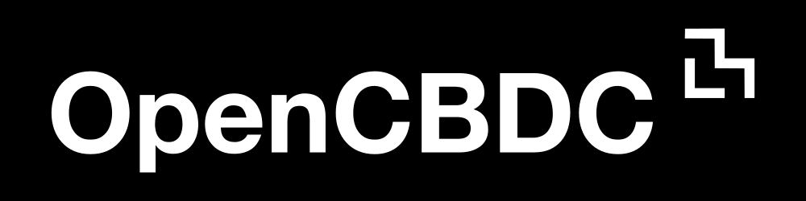

<h1 align="center">

</h1><br>


[](docs/code_of_conduct.md)
[](https://opencbdc.zulipchat.com/register/)
[](https://opensource.org/licenses/MIT)


# Introduction

OpenCBDC is a technical research project focused on answering open questions surrounding central bank digital currencies (CBDCs).

This repository includes the core transaction processor for a hypothetical, general purpose central bank digital currency (CBDC).
Initially, this work was derived from Project Hamilton (a collaboration between the MIT Digital Currency Initiative (DCI) and the Federal Reserve Bank of Boston (FRBB)).

For higher-level conceptual explanations, as well as findings and conclusions related to this code, see [our research paper](https://dci.mit.edu/opencbdc).

Initially, we focused our work on achieving high transaction throughput, low latency, and resilience against multiple geographical datacenter outages without significant downtime or any data loss.
The design decisions we made to achieve these goals will help inform policy makers around the world about the spectrum of tradeoffs and available options for CBDC design.

# News

If there are significant changes to the repository that may require manual downstream intervention (or other important updates), we will make a [NEWS post](NEWS.md).

# Architecture

We have explored several architectures under two broad categories as follows:

## UHS-Based Transaction Processor

We explored two system architectures for transaction settlement based on an [unspent transaction output (UTXO)](https://en.wikipedia.org/wiki/Unspent_transaction_output) data model and transaction format.
Both architectures implement the same schema representing an [unspent hash set (UHS)](https://lists.linuxfoundation.org/pipermail/bitcoin-dev/2018-May/015967.html) abstraction.
One architecture provides [linearizability](https://en.wikipedia.org/wiki/linearizability) of transactions, whereas the other only provides [serializability](https://en.wikipedia.org/wiki/Serializability).
By relaxing the ordering constraint, the peak transaction throughput supported by the system scales horizontally with the number of nodes, but the transaction history is unavailable making the system harder to audit retroactively.
Both architectures handle multiple geo-distributed datacenter outages with a [recovery time objective (RTO)](https://en.wikipedia.org/wiki/Disaster_recovery#Recovery_Time_Objective) of under ten seconds and a [recovery point objective (RPO)](https://en.wikipedia.org/wiki/Disaster_recovery#Recovery_Point_Objective) of zero.

There are two UHS-based architectures as follows:

1. "Atomizer" architecture
    - Materializes a total ordering of all transactions settled by the system in a linear sequence of batches.
    - Requires vertical scaling as peak transaction throughput is limited by the performance of a single system component.
    - Maximum demonstrated throughput ~170K transactions per second.
    - Geo-replicated latency <2 seconds.
1. "Two-phase commit" architecture
    - Transaction history is not materialized and only a relative ordering is assigned between directly related transactions.
    - Combines [two-phase commit (2PC)](https://en.wikipedia.org/wiki/Two-phase_commit_protocol) and [conservative two-phase locking (C2PL)](https://en.wikipedia.org/wiki/Conservative_two-phase_locking) to create a system without a single bottlenecked component where peak transaction throughput scales horizontally with the number of nodes.
    - Maximum demonstrated throughput ~1.7M transactions per second.
    - Geo-replicated latency <1 second.

Read the [2PC & Atomizer architecture guide](docs/uhs-architectures.md) for a detailed description of the system components and implementation of each architecture.

## Parallel Architecture for Scalably Executing smart Contracts ("PArSEC")

We built a system with a generic virtual machine layer that is capable of performing parallel executions of smart contracts.

The architecture is composed of two layers:

1. A distributed key-value data store with [ACID](https://en.wikipedia.org/wiki/ACID) database properties
    - This back-end data store is not constrained to any type of data and is agnostic to the execution later.
1. A generic virtual machine layer that executes programs (i.e. smart contracts) and uses the distributed key-value data store to record state
    - This computation layer defines the data models and transaction semantics.
    - We have implemented the Ethereum Virtual Machine EVM and a Lua based virtual machine as two working examples.

- This architecture enables parallel execution of smart contracts which can be scaled horizontally where keys are independent.
- Unmodified smart contracts from the Ethereum ecosystem can be deployed directly onto our EVM implementation.

Read the [PArSEC Architecture Guide](docs/parsec_architecture.md) for more details.

# Contributing and Discussion

You can join the [OpenCBDC mailing list](https://dci.mit.edu/opencbdc-interest) to receive updates from technical working groups and learn more about our work.
If you would like to join our technical discussions and help workshop proposals, you can join our [Zulip chat](https://opencbdc.zulipchat.com/register/).

For more information on how to contribute, please see our [Contribution Guide](docs/contributing.md)!

If you want to dive straight in, take a look at our issue tracker's list of [good first issues](https://github.com/mit-dci/opencbdc-tx/labels/difficulty%2F01-good-first-issue).

# Setup

If you would like to install OpenCBDC and run it on your local machine, follow the steps below:

## Get the Code

1. [Install Git](https://git-scm.com/book/en/v2/Getting-Started-Installing-Git)
1. Clone the repository (including the submodules using: `--recurse-submodules`)

   ```console
   $ git clone --recurse-submodules https://github.com/mit-dci/opencbdc-tx
   ```

## Setup the build environment

Use these directions if you would like to build the source code on your machine.
Alternatively, if you just want to run the system, skip to the [Run the Code](#run-the-code) section below.

1. Setup the build-environment

   Note that this script is just a convenience to install system-wide dependencies we expect.
   As a result, it uses the system package manager, requires `sudo`, and should only be run **once**.
   ```console
   # ./scripts/install-build-tools.sh
   ```
   Note: Running Homebrew as root on mac via shell script is not supported, so run without sudo and when prompted, enter the root password.
   ```console
   $ ./scripts/install-build-tools.sh
   ```

1. Setup project dependencies

   This script builds and installs a local copy of several build-dependencies that are not widely packaged.
   Because the installation is done in a user-specific location (`./prefix` by default) rather than a system-wide one, you do not need root permission to run the script.
   Additionally, if you want to remove the installed build-dependencies or restart the installation process, you can safely delete the `prefix` directory and rerun this script.
   ```console
   $ ./scripts/setup-dependencies.sh
   ```
1. Run the build script
   ```console
   $ ./scripts/build.sh
   ```

### macOS

Note that if you have not already installed the xcode cli tools you will need to:

```console
# xcode-select --install
```
# Documentation

Github Pages hosts the official copy of the OpenCBDC [API Reference](https://mit-dci.github.io/opencbdc-tx-pages/).

This reference is housed in [an external repository](https://github.com/mit-dci/opencbdc-tx-pages/).

## Running the Code

### UHS-based Architectures (2PC & Atomizer)

See the [2PC & Atomizer User Guide](docs/2pc_atomizer_user_guide.md)

### PArSEC Architecture
See the [PArSEC User Guide](docs/parsec_user_guide.md)

# Testing

Users can verify the setup by running both unit/integration and end-to-end tests on OpenCBDC.

## Unit and Integration Tests

### Running the tests:

1. Build all Docker images

   ```console
   $ ./scripts/build-docker.sh
   ```
1. Run Unit and Integration Tests

   ```console
   $ docker run -ti opencbdc-tx-builder ./scripts/test.sh
   ```

## E2E Testing with Kubernetes

### Requirements

- Go (go test library used to run tests)
- Minikube
- Helm
- Kubectl

### Running the tests:

```console
$ ./scripts/build-docker.sh
```

```console
$ ./scripts/test-e2e-minikube.sh
```

Review results and logs at `testruns/<testrun-uuid>/`

## Linting

### General

This script checks for newlines at the end of all tracked git files except images.
Then it runs clang-format and clang-tidy on `.cpp` files in the following directories:
 `src`, `tests`, `cmake-tests`, `tools`.

```console
$ ./scripts/lint.sh
```

### Python

Lint all python files according to ruleset defined in `.pylintrc`.
Optional code quality value >= 5.0 and <= 10.0 can be entered as a threshold of failure.

```console
$ ./scripts/pylint.sh 8.0
```

## Virtual Environment for Python

`./scripts/install-build-tools.sh` creates a virtual environemnt.  
Once run, follow these steps to run python code.

1. Activate the virtual environment which has the required python version and packages installed.
   ```console
   $ source ./scripts/activate-venv.sh
   ```

2. Run python code
   ```console
   (.py_venv) $ python ./scripts/<script_name>.py
   ```

3. Exit the virtual environment
   ```console
   (.py_venv) $ deactivate
   ```
