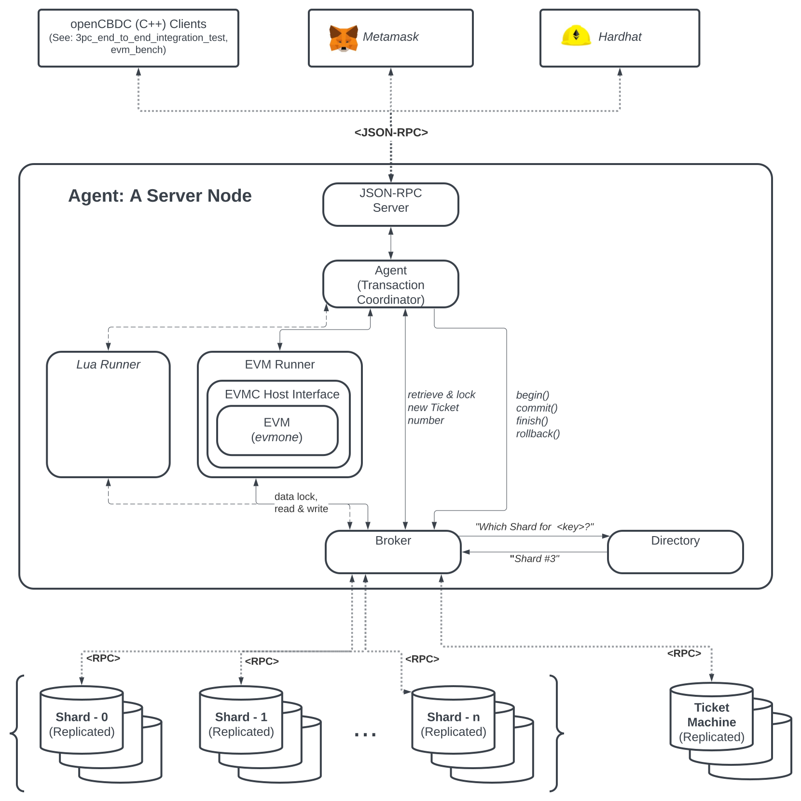

# PArSEC Architecture Overview

At a high conceptual level, the architecture consists of two layers.

The lower-level layer is a generic distributed key-value data store providing [ACID](https://en.wikipedia.org/wiki/ACID) database transactional properties.
This data store is generic as it does not impose constraints on the type or the size of the data it handles, and is agnostic to its client execution layer.
The end user does not directly interact with this layer.
The implementation consists of a set of shard instances, where each instance is [Raft](https://en.wikipedia.org/wiki/Raft_(algorithm))-replicated for resilience.
Data is horizontally partitioned among this set of replicated shard units - i.e. each replicated shard unit holds its own distinct subset of the full data set.

The higher level computation layer executes programs (i.e. smart contracts) and uses the lower-level key-value data store to maintain its state.
The _Agent_ is the main interface for this layer and serves the role of a transaction coordinator.
This computation layer contains implementations of the _Runner_ interface which is an abstraction for retrieving and executing context-specific bytecode.
The system provides two _Runner_ implementations ([EVM](https://ethereum.org/en/developers/docs/evm/) and [Lua](https://www.lua.org/)) and demonstrates the flexibility of the architecture to support different program execution environments.

# Key Features
### Flexible Data Model and Transaction Semantics
In contrast to the [UHS-based architectures (Atomizer & 2PC)](architecture.md), this design does not dictate a particular data model or transactional semantics.
The generic computation layer allows flexibility to employ a wide range of designs with minimal changes to this underlying C++ system.
Smart contracts can be deployed and re-defined, thus making it possible to make fundamental changes to the system during runtime.

### Parallel Smart Contract Execution
This architecture enables parallel execution of generic smart contracts (where keys are independent).
Therefore transaction throughput is horizontally scalable with additional server resources.
For example, in contrast to the Ethereum blockchain, this system executes native value transfers and smart contract transactions (e.g. [ERC20 token](https://ethereum.org/en/developers/docs/standards/tokens/erc-20/) transfers) in parallel for independent addresses.

# Architecture Diagram

# System Components
### Agent (Transaction Coordinator)
The _Agent_ is the main interface for the computation layer and serves the role of a transaction coordinator.
An Agent is instantiated for each new transaction, managing the transaction's lifecycle by interacting with both the _Runner_ and the data store (via the _Broker_)
### Broker
The _Broker_ is the interface component for both the external _Shards_ and the _Ticket Machine_.
The _Broker_'s primary role is to abstract the external set of distributed _Shards_ as a single logical database unit, providing functions such as _begin()_, _commit()_, _finish()_ and _rollback()_.
The _Broker_ is also the interface for the _Ticket Machine_ for the _Agent_.
### Directory
The _Directory_ identifies the target _Shard_ unit for each and every key-value data pair.
This is a detail managed by the _Broker_, allowing the end-client (the _Agent_) to interact with the distributed _Shards_ as a single database unit.
The _Directory_ is where the sharding logic is defined and its implementation can be designed to optimize database resources for particular use cases.
### JSON-RPC Server
The _JSON-RPC Server_ implements the [Ethereum JSON-RPC API](https://ethereum.org/en/developers/docs/apis/json-rpc/) over HTTP.
This is the external interface compatible for external Ethereum clients such as wallets (e.g. Metamask), and development tools (e.g. Hardhat, Truffle, ethers.js, web3.js)
### Runner
The _Runner_ is an abstraction for retrieving and executing context-specific bytecode.
The system provides two _Runner_ implementations ([EVM](https://ethereum.org/en/developers/docs/evm/) and [Lua](https://www.lua.org/)) and demonstrates the flexibility of the architecture to support different program execution environments.
### Shards
The lower-level data store layer implementation consists of a set of _Shard_ instances, where each instance is [Raft](https://en.wikipedia.org/wiki/Raft_(algorithm))-replicated for resilience.
Data is horizontally partitioned among this set of replicated _Shard_ units - i.e. each replicated _Shard_ unit holds its own distinct subset of the full data set.
### Ticket Machine
The _Ticket Machine_ is tasked with providing the system with _Ticket Numbers_ which are a sequence of unique and increasing whole numbers.
Each transaction is assigned its own unique new _Ticket Number_.
The value of the _Ticket Number_ conveys the relative age of the transaction which is used for database concurrency control and deadlock resolution.
